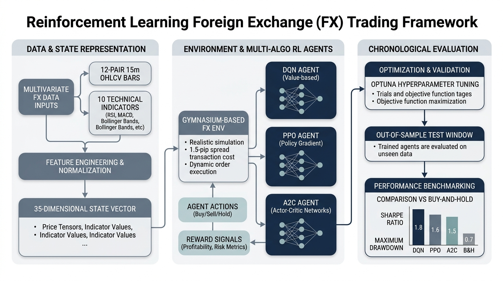

# Multi-Algorithm Reinforcement Learning for Foreign Exchange Trading Under Transaction Costs

Reinforcement learning (RL) offers a compelling paradigm for algorithmic trading by learning policy representations directly from reward signals rather than relying on hand-crafted heuristic rules. However, standard applications of RL in financial markets frequently suffer from three fundamental vulnerabilities: frictionless backtest overfitting, single-algorithm selection bias, and isolated single-instrument state definitions. Agents trained without transaction costs tend to learn high-frequency churn strategies that exploit backtest frictionless assumptions but collapse immediately when subjected to real-world market spreads and execution fees. Furthermore, reporting results from a single RL algorithm risks mistaking architecture-specific artifacts for general market tradeability, while modeling a target currency pair in isolation discards valuable cross-market correlation signals. This project addresses these challenges by developing a multi-algorithm RL trading framework for EUR/USD incorporating cross-market context, technical indicator features, realistic spread and fee cost models, and strict chronological out-of-sample evaluation.

The market data infrastructure ingests 1-minute bid-side tick archives for 12 major currency pairs—EUR/USD as the primary target instrument, alongside GBP/USD, USD/JPY, USD/CHF, AUD/USD, USD/CAD, NZD/USD, EUR/JPY, GBP/JPY, EUR/CHF, EUR/GBP, and AUD/JPY—resampled to 15-minute bars over a multi-year panel. Data preprocessing establishes an exact 12-pair intersection timeline and enforces a strict missing-bar constraint: gaps up to four consecutive 15-minute bars are forward-filled, whereas timestamps exceeding this threshold are dropped across all pairs simultaneously to prevent synthetic data contamination. The dataset is partitioned into strictly ordered, non-overlapping chronological splits: a multi-year training split, a three-year validation split for hyperparameter tuning, and a final three-year out-of-sample evaluation split.

At each 15-minute decision epoch, the agent observes a 35-dimensional state representation comprising the eight most recent log-returns of EUR/USD, the contemporaneous log-returns of all 11 context currency pairs, 10 causal technical indicators computed on EUR/USD (including SMA, EMA, RSI, MACD, Bollinger Band width, ATR, Stochastic Oscillator, ADX, Rate of Change, and 20-bar annualized realized volatility), cyclic sine/cosine calendar encodings for hour-of-day and day-of-week, the current position state, and the unrealized open position return. State normalization parameters are fitted strictly on the training split and frozen across validation and evaluation splits to ensure zero look-ahead data leakage.

The environment implements a discrete action space allowing the agent to set target market exposure to short, flat, or long. Execution timing follows a market-on-close convention where actions selected at bar $t$ govern exposure during bar $t+1$. Transaction frictions are modeled explicitly via a 1.5-pip one-way spread cost and an optional 0.5-bps percentage commission. Position reversals from short to long or long to short are double-charged to account for two separate transactions. Rewards are formulated as exact portfolio log-returns, penalizing cost-drag directly within the RL optimization objective.

Three distinct RL algorithm families—Deep Q-Networks (DQN), Proximal Policy Optimization (PPO), and Advantage Actor-Critic (A2C)—are trained using multi-layer perceptron architectures and tuned via Bayesian hyperparameter optimization on validation-window Sharpe ratio. Tuning is executed independently under zero-commission and commission environments, yielding six distinct policy configurations. Out-of-sample performance is evaluated across annualized Sharpe ratio, Sortino ratio, cumulative return, and maximum drawdown, benchmarked against passive EUR/USD Buy-and-Hold and a deterministic rule-based SMA crossover strategy.

Implementation details, execution tier runbooks, and Vast.ai GPU deployment commands live in `runbook.md`.
